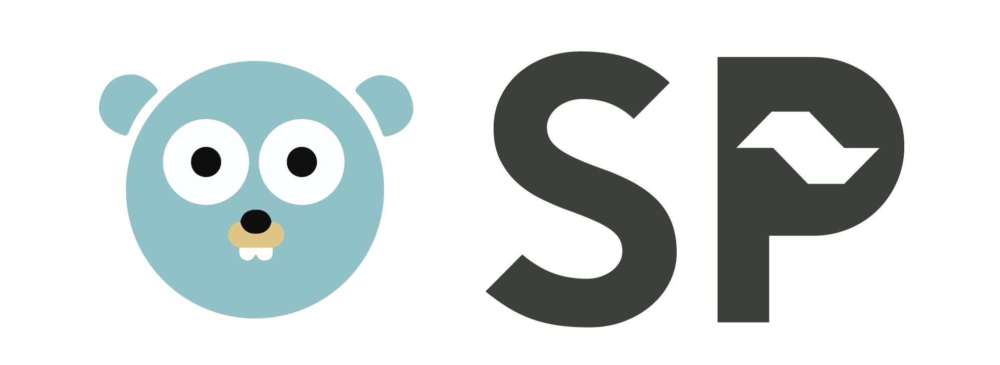

  

<h2 align="center">Workshop para iniciantes - Microsoft Reactor - Golang SP</h2>

 
      

## Instalação de dependências

Para garantir uma dinâmica melhor no dia, aqui está um guia de preparação com todas as aplicações que deverão ser instaladas antes de atender ao evento.

Você deverá ter instalado as seguintes dependências:
  - [Go](https://go.dev/dl/)
  - [Git](https://git-scm.com/downloads)
  - [Visual Studio Code](https://code.visualstudio.com/Download) (opcional)

> Opcionalmente você pode instalar a extensão [Go](https://marketplace.visualstudio.com/items?itemName=golang.Go) no Visual Studio Code.

Leia os arquivos `README_<OS>.md` na pasta [prerequisites](https://github.com/reneepc/workshop-go-for-beginners/tree/main/prerequisites) para saber como instalar as dependências no seu sistema operacional.